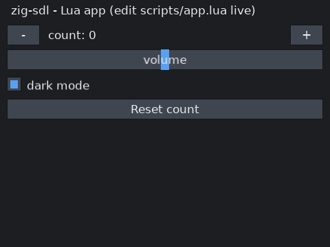

# zig-sdl GUI

A small **immediate-mode GUI** for **Zig + SDL3** with **Lua-scripted app logic** and
**hot-reload**. The same UI code is designed to run locally, or split across an optional
"umbilical" socket (UI server ↔ UI client) for desktop, mobile, or a VPS — see
[Roadmap](#roadmap).

> Status: **Phase 1 + Phase 2 complete and verified** (local window, widgets, layout, Lua
> logic, live hot-reload). Networking (Phase 3) and Android (Phase 4) are designed-for but
> not yet built.



## The one idea

The GUI is a function whose edges are plain data:

```
frame(state, input_events, ui) -> (state', command_buffer)
```

- The app logic (`frame`) is authored in **Lua** (`scripts/app.lua`) and runs against a
  **native Zig core**.
- Widgets don't paint pixels — they append to a **command buffer**; a layout engine resolves
  their rectangles.
- Because both the input and the command buffer are serializable, the same logic can later run
  in-process or across a socket without changing the UI code (the umbilical).

## Requirements

- **Zig 0.17.0-dev** (this targets the dev build's APIs: translate-c instead of `@cImport`,
  unmanaged `ArrayList`, `createModule`/`root_module`).
- System libraries (Debian/Ubuntu package names):
  `libsdl3-dev libsdl3-ttf-dev libsdl3-image-dev libluajit-5.1-dev`
  (pkg-config names: `sdl3`, `sdl3-ttf`, `sdl3-image`, `luajit`).
- A TTF font (defaults to DejaVuSans at `/usr/share/fonts/truetype/dejavu/DejaVuSans.ttf`).

## Build & run

```sh
zig build            # compile
zig build run        # compile + run (Lua-driven UI from scripts/app.lua)
zig build test       # run unit tests (interaction logic + hot-reload)
```

The binary is `zig-out/bin/zigui`.

### Configuration (environment variables)

Config is read via `SDL_getenv` (the std args API is mid-rework in this Zig dev build):

| Var            | Meaning                                                        |
|----------------|---------------------------------------------------------------|
| `ZIGUI_FONT`   | Path to a `.ttf` (default: DejaVuSans)                         |
| `ZIGUI_SCRIPT` | Path to the Lua app (default: `scripts/app.lua`)              |
| `ZIGUI_NATIVE` | If set, use the built-in native demo instead of Lua          |
| `ZIGUI_FRAMES` | Render N frames then quit (for headless/CI; 0 = run forever)  |
| `ZIGUI_SHOT`   | Save a BMP screenshot of the last frame                       |

Example headless smoke test:

```sh
ZIGUI_FRAMES=8 ZIGUI_SHOT=/tmp/shot.bmp ./zig-out/bin/zigui
```

## Writing UI (Lua)

Edit `scripts/app.lua` **while the app is running** — it hot-reloads within a frame and your
state is preserved. Interactions are return values, not callbacks:

```lua
function frame(ui, s)
  s.count = s.count or 0

  ui.label("Hello")

  -- a row: 48px button | filling label | 48px button
  ui.row{ 48, -1, 48 }
  if ui.button("-") then s.count = s.count - 1 end
  ui.label("count: " .. s.count)
  if ui.button("+") then s.count = s.count + 1 end

  s.vol  = ui.slider("volume", s.vol or 0.5, 0, 1)
  s.dark = ui.checkbox("dark", s.dark or false)
end
```

A custom widget is just a Lua function built from the same primitives:

```lua
local function counter(ui, label, v)
  ui.row{ 40, -1, 40 }
  if ui.button("-") then v = v - 1 end
  ui.label(label .. ": " .. v)
  if ui.button("+") then v = v + 1 end
  return v
end
```

### The `ui` API (currently bound to Lua)

| Call | Returns | Notes |
|------|---------|-------|
| `ui.label(text)` | – | left-aligned text |
| `ui.button(text)` | `bool` | true on click |
| `ui.checkbox(text, value)` | `bool` | the (possibly toggled) value |
| `ui.slider(text, value, min, max)` | `number` | the (possibly dragged) value |
| `ui.row{ w1, w2, ... [, height] }` | – | column widths: `>1` px, `0..1` fraction, `<=0` fill |

If a row isn't declared, each widget gets its own full-width row.

## Architecture / source layout

```
src/
  cdefs.h              C headers for the build's translate-c step (SDL3 + ttf + image + LuaJIT)
  sdl.zig              re-exports the translated C module as `c`
  ui/
    command.zig        Command / InputEvent / Viewport / Rect / Color  (the serializable boundary)
    core.zig           Context: layout engine, IDs, pointer model, public widget-building API
    widgets.zig        example widgets on the public API (replaceable userland) + tests
    theme.zig          colors + DPI-scaled metrics
  render/
    sdl_backend.zig    window/renderer/font; renders the command buffer; text cache; input -> InputEvent
  script/
    lua.zig            Zig<->LuaJIT binding; runs frame(); file-watch hot-reload + error guard + tests
  main.zig             entry point; wires backend + context + (Lua | native) loop
scripts/
  app.lua              THE app logic you edit live
build.zig{,.zon}       targets Zig 0.17-dev; links the system libs via translate-c
```

Key design choices:

- **Widgets are userland.** The toolkit's value is the public API on `Context`
  (`layout`/`interaction`/`draw` primitives). `widgets.zig` is example widgets nothing depends
  on; you replace or compose freely (in Zig or Lua).
- **`core` calls no SDL.** Widgets only append `Command`s and read the unified pointer, so the
  exact same code can run headless on a server (Phase 3).
- **Touch-ready.** Mouse and `SDL_EVENT_FINGER_*` map to the same `InputEvent`s.
- **Text is measured, not embedded.** The core measures via a backend callback so layout is
  exact; the backend rasterizes + caches glyph textures (tinted per draw via color-mod).

## Tests

`zig build test` runs:
- widget interaction logic (button click across press+release, checkbox toggle, slider drag),
- Lua frame output + **hot-reload** (edit → reload → new output) + the bad-edit error guard.

## Roadmap

- **Phase 3 — Umbilical:** `net/` with a length-prefixed codec + `Transport { Local, Tcp }`;
  modes `--server` / `--client`; two channels (remote-render and Lua `ScriptPush`). Works
  desktop↔desktop, over a VPS, or to a phone via `adb reverse`.
- **Phase 4 — Android:** package the native host with SDL3; connect over the USB umbilical.
- **Later:** multi-session server, TLS/auth, scrolling/text-input widgets, image-heavy demos.

The architecture is built so these are additive — the `frame`/command-buffer boundary and the
public widget API don't change.
